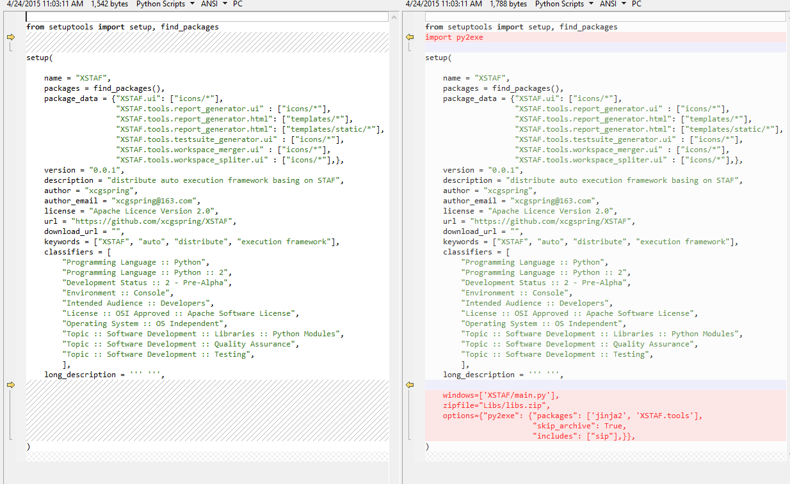

.. _`compile to binary`:

=========================
编译成二进制文件
=========================

:Page Status: Development
:Last Reviewed: 

对于某些应用，可能会需要将python应用打包成独立的可执行文件，这样可以发布给别人直接使用，不需要安装python或其他依赖，而且可以某种程度上保护源代码。
一般对于desktop app有这样的需求，对于web app，脚本，python库一般没有这样的需求。

下面介绍几个python工具来满足这种需求

py2exe
===============

py2exe支持将python app转化成windows exe，支持python2.7和python3.3

py2exe for python2.7 host在 `sourceforge上 <http://sourceforge.net/projects/py2exe>`_

py2exe for python3.3 host在 `PyPI上 <https://pypi.python.org/pypi/py2exe>`_

基本使用步奏
---------------

参考 `py2exe Tutorial <http://www.py2exe.org/index.cgi/Tutorial>`_

1. 安装py2exe
2. 安装打包所需windows runtime， 对于python2.7和python3.3， 需要安装VS2008或 `Microsoft Visual C++ 2008 Redistributable Package <http://www.microsoft.com/downloads/en/details.aspx?FamilyID=9b2da534-3e03-4391-8a4d-074b9f2bc1bf&displaylang=en>`_
3. 编写或修改setup.py，setup.py中py2exe的参数参考 `ListOfOptions <http://www.py2exe.org/index.cgi/ListOfOptions>`_
4. 打包 ``python setup.py sdist py2exe``

一个加入py2exe支持的setup.py，和普通的setup.py的比较：

    
.. note::

    如果安装完windows runtime，仍然提示 ``msvcp90.dll`` 找不到，你需要手动将 ``msvcm90.dll, msvcp90.dll, msvcr90.dll`` 拷贝到 ``C:\Python27\DLLs\``
    
    如果安装了VS2008，这些文件路径位于 ``C:\\Program Files\\Microsoft Visual Studio 9.0\\VC\\redist\\x86\\Microsoft.VC90.CRT``
    
    如果仅仅是安装了 ``Microsoft Visual C++ 2008 Redistributable Package``， 这些文件路径一般类似于 ``C:\Windows\WinSxS\x86_microsoft.vc90.crt_1fc8b3b9a1e18e3b_9.0.30729.6161_none_50934f2ebcb7eb57``

.. note::

    如果你的python应用用了一些特殊的库，比如PyQt，可能会遇到一些问题，参见 `Working with Various Packages and Modules <http://www.py2exe.org/index.cgi/WorkingWithVariousPackagesAndModules>`_
    
pyinstaller
===============

pyinstaller支持将python app转化成windows/linux/mac上的可执行文件，支持python2.7，host在 `PyPI上 <https://pypi.python.org/pypi/PyInstaller>`_

